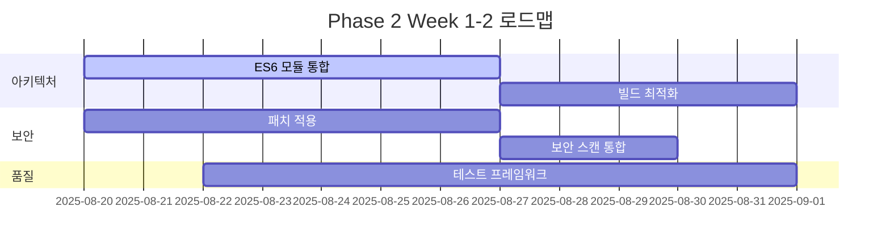

# 🚀 WAVE SPACE Phase 2 통합 전략

**전략 수립일**: 2025-08-20  
**담당 전문가**: DevOps 및 문서화 전문가  
**통합 대상**: 모듈 아키텍처, UI/UX, 보안, 코드 품질 전문가 작업

---

## 📊 Phase 1 완료 상태 분석

### ✅ 완료된 전문가 작업
1. **모듈 아키텍처 전문가** - ES6 모듈 시스템 완성
2. **UI/UX 전문가** - 접근성 및 컴포넌트 설계 완료  
3. **보안 전문가** - 14개 취약점 식별 및 패치 설계
4. **코드 품질 전문가** - ESLint/Prettier, 중복 코드 제거
5. **DevOps 전문가** - 빌드 시스템, CI/CD, 문서화 표준

### 🔄 통합 준비 상태
- **기술 스택**: 통일된 빌드 시스템 (Vite)
- **코드 품질**: 표준화된 린팅 및 포맷팅
- **배포**: 자동화된 CI/CD 파이프라인
- **문서**: 체계적인 문서화 프레임워크

---

## 🎯 Phase 2 핵심 목표

### 1. 아키텍처 통합
**목표**: 모든 전문가 설계를 하나의 일관된 시스템으로 통합

#### 주요 작업
- [ ] **모듈 시스템 최종 통합** (우선순위: 높음, 예상 기간: 1-2주)
  - ES6 모듈과 빌드 시스템 연동
  - 동적 import 최적화
  - 트리 셰이킹 구현

- [ ] **컴포넌트 라이브러리 구축** (우선순위: 높음, 예상 기간: 2-3주)
  - UI/UX 전문가 설계 구현
  - 재사용 가능한 컴포넌트 표준화
  - 디자인 시스템 코드화

#### 연계 방안
- 모듈 아키텍처 전문가와 주간 동기화 미팅
- Vite 설정과 ES6 모듈 최적화 공동 작업
- 성능 메트릭 기반 아키텍처 검증

### 2. 보안 강화 구현
**목표**: 식별된 보안 취약점 해결 및 보안 모니터링 구축

#### 주요 작업  
- [ ] **14개 보안 패치 적용** (우선순위: 높음, 예상 기간: 1주)
  - 보안 전문가 설계 기반 패치 구현
  - CI/CD 파이프라인에 보안 스캔 통합
  - 자동화된 취약점 모니터링

- [ ] **보안 정책 자동화** (우선순위: 중간, 예상 기간: 2주)
  - Content Security Policy 구현
  - 자동화된 보안 테스트
  - 보안 이벤트 로깅

#### 연계 방안
- 보안 전문가와 패치 우선순위 협의
- GitHub Actions에 보안 스캔 도구 통합
- 주간 보안 리포트 자동 생성

### 3. 품질 보증 시스템
**목표**: 지속적인 코드 품질 유지 및 자동화

#### 주요 작업
- [ ] **종합 테스트 프레임워크** (우선순위: 중간, 예상 기간: 2-3주)
  - 단위 테스트 및 통합 테스트
  - 접근성 자동 테스트
  - 성능 회귀 테스트

- [ ] **품질 메트릭 대시보드** (우선순위: 낮음, 예상 기간: 1-2주)
  - 실시간 품질 지표 모니터링
  - 코드 커버리지 추적
  - 기술 부채 측정

#### 연계 방안
- 코드 품질 전문가와 메트릭 기준 정의
- ESLint 규칙과 품질 게이트 연동
- 자동화된 품질 리포트 생성

---

## 🏗️ 구현 로드맵

### Week 1-2: 기초 통합


### Week 3-4: 고급 기능
- **성능 최적화**: Lighthouse CI 완전 통합
- **모니터링**: 실시간 성능 추적
- **자동화**: 완전 자동화된 배포 파이프라인

### Week 5-6: 최종 통합
- **문서화 완료**: 모든 시스템 문서화
- **교육 자료**: 팀 온보딩 가이드
- **운영 준비**: 프로덕션 배포 준비

---

## 🔧 기술적 통합 방안

### 1. 빌드 시스템 통합
```javascript
// vite.config.js 확장
export default defineConfig({
  plugins: [
    // UI 컴포넌트 최적화
    vue(), // 필요시 프레임워크 추가
    
    // 보안 강화
    csp({
      policy: {
        'default-src': ["'self'"],
        'script-src': ["'self'", "'unsafe-inline'"],
        'style-src': ["'self'", "'unsafe-inline'"]
      }
    }),
    
    // 성능 모니터링
    bundleAnalyzer({
      analyzerMode: 'server',
      openAnalyzer: false
    })
  ]
});
```

### 2. 품질 게이트 확장
```bash
# 통합된 품질 검사 파이프라인
npm run quality-gates    # 종합 품질 검사
npm run security-scan    # 보안 취약점 스캔
npm run performance-test # 성능 측정
npm run accessibility    # 접근성 검사
```

### 3. 모니터링 통합
```yaml
# .github/workflows/monitoring.yml
name: 🔍 Integrated Monitoring
on:
  schedule:
    - cron: '0 9 * * *'  # 매일 오전 9시

jobs:
  comprehensive-check:
    runs-on: ubuntu-latest
    steps:
      - name: 📊 Architecture Health
      - name: 🔒 Security Status  
      - name: 📈 Performance Metrics
      - name: ♿ Accessibility Report
      - name: 🏆 Quality Score
```

---

## 📋 Phase 2 체크리스트

### 아키텍처 통합 (40%)
- [ ] ES6 모듈 시스템 최적화
- [ ] 컴포넌트 라이브러리 구축
- [ ] 성능 최적화 적용
- [ ] 트리 셰이킹 구현

### 보안 구현 (30%)
- [ ] 14개 보안 패치 적용
- [ ] CSP 정책 구현
- [ ] 자동화된 보안 스캔
- [ ] 보안 모니터링 설정

### 품질 보증 (20%)
- [ ] 테스트 프레임워크 구축
- [ ] 품질 메트릭 대시보드
- [ ] 자동화된 품질 검사
- [ ] 코드 커버리지 목표 달성

### 운영 준비 (10%)
- [ ] 프로덕션 배포 파이프라인
- [ ] 모니터링 및 알림 설정
- [ ] 문서화 완료
- [ ] 팀 교육 자료

---

## 🚨 리스크 관리

### 기술적 리스크
| 리스크 | 확률 | 영향도 | 대응 방안 |
|--------|------|--------|-----------|
| 모듈 통합 복잡성 | 중간 | 높음 | 점진적 통합, 롤백 계획 |
| 성능 저하 | 낮음 | 중간 | 지속적 모니터링, 최적화 |
| 보안 패치 충돌 | 중간 | 높음 | 철저한 테스트, 단계적 적용 |

### 일정 리스크
| 리스크 | 확률 | 영향도 | 대응 방안 |
|--------|------|--------|-----------|
| 통합 지연 | 중간 | 중간 | 우선순위 조정, 인력 투입 |
| 테스트 시간 부족 | 높음 | 중간 | 자동화 확대, 병렬 테스트 |
| 문서화 지연 | 낮음 | 낮음 | 개발과 동시 진행 |

---

## 📞 커뮤니케이션 계획

### 정기 미팅
- **일일 스탠드업**: 통합 진행 상황 공유
- **주간 싱크**: 전문가 간 이슈 해결
- **Sprint Review**: 2주마다 통합 결과 검토

### 의사소통 채널
- **Slack**: #phase2-integration (실시간 소통)
- **GitHub**: Issues, PR 리뷰 (코드 중심 논의)
- **Confluence**: 설계 문서, 회의록 (구조화된 정보)

### 리포팅
- **주간 리포트**: 진행률, 이슈, 다음 주 계획
- **월간 대시보드**: KPI, 품질 지표, ROI 분석
- **마일스톤 리뷰**: 주요 단계별 성과 평가

---

## 🏆 성공 지표

### 정량적 지표
- **통합 완성도**: 100% 모듈 통합
- **보안 점수**: 95% 이상 보안 스캔 통과
- **성능 지표**: Core Web Vitals 목표 달성
- **품질 점수**: 90/100 이상 품질 게이트 통과

### 정성적 지표
- **개발자 만족도**: 통합된 워크플로우 사용성
- **운영 안정성**: 배포 성공률 및 롤백 빈도
- **코드 품질**: 리뷰 시간 단축, 버그 감소
- **팀 협업**: 크로스 펑셔널 팀 효율성

---

## 🔮 Phase 3 준비

### 확장 계획
- **마이크로프론트엔드**: 모듈별 독립 배포
- **PWA**: 프로그레시브 웹 앱 전환
- **국제화**: 다국어 지원 시스템
- **AI 통합**: 자동화된 코드 리뷰, 성능 최적화

### 기술 스택 진화
- **TypeScript**: 점진적 타입 도입
- **Web Components**: 프레임워크 독립적 컴포넌트
- **Edge Computing**: CDN 최적화
- **모니터링**: APM 도구 통합

---

**이 문서는 살아있는 계획서입니다**: Phase 2 진행 상황에 따라 지속적으로 업데이트됩니다.

**다음 리뷰**: 2025-08-27 (Phase 2 킥오프 미팅)  
**책임자**: DevOps 및 문서화 전문가 + 아키텍처 리드